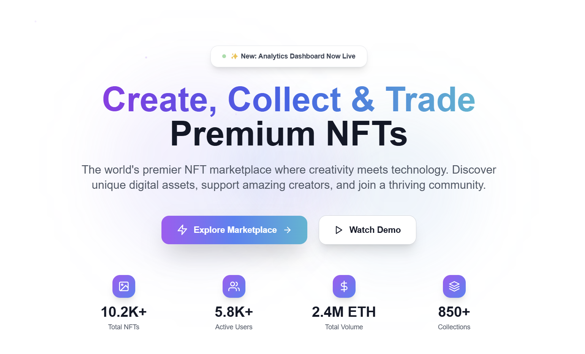
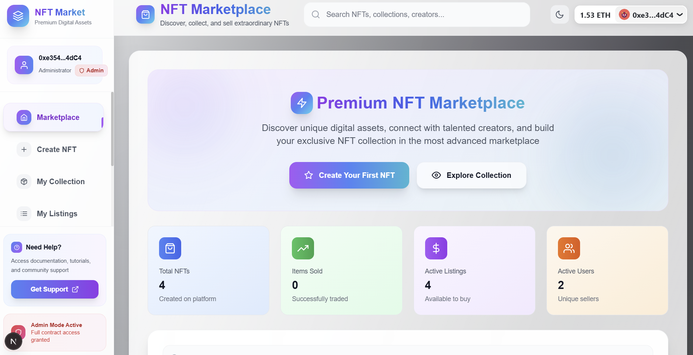
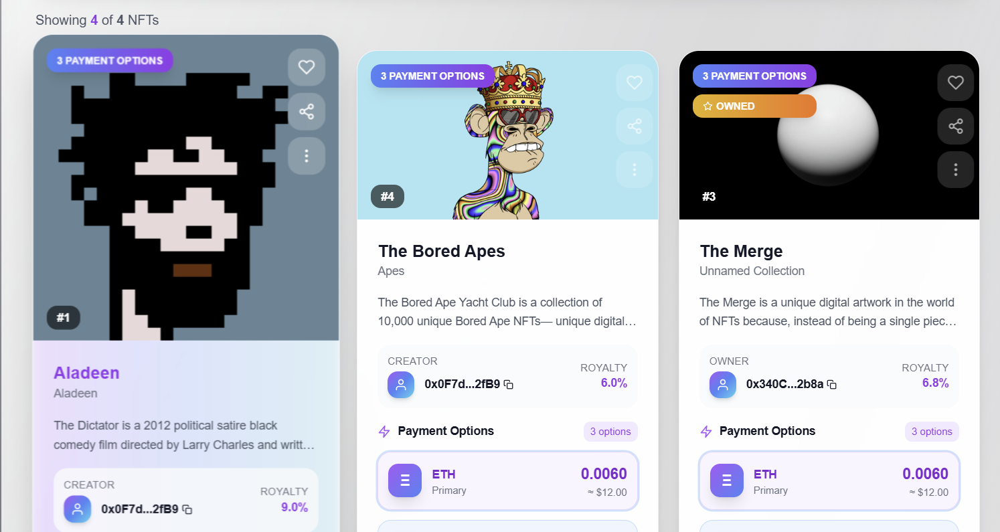
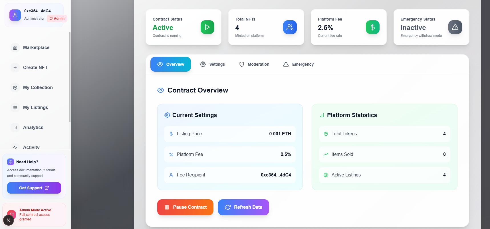
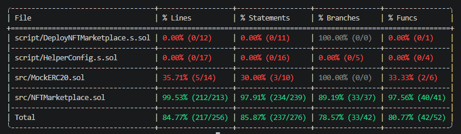

# 🖼️ NFT Marketplace — Full-Stack Web3 dApp

> A production-grade, fully decentralized NFT marketplace built on Ethereum Sepolia — supporting ETH, USDC, and USDT payments, on-chain royalties (EIP-2981), cancel listings, and a complete admin dashboard with emergency controls.

[](https://nft-marketplace-mod.vercel.app)
[](https://sepolia.etherscan.io/address/0x340C12a94DD8BB553E2259884079B99afc132b8a)
[](https://sepolia.etherscan.io/address/0x340C12a94DD8BB553E2259884079B99afc132b8a#code)
[](#testing)
[](https://github.com)

**Live:** https://nft-marketplace-mod.vercel.app  
**Contract:** [`0x340C12a94DD8BB553E2259884079B99afc132b8a`](https://sepolia.etherscan.io/address/0x340C12a94DD8BB553E2259884079B99afc132b8a)

---

## Screenshots

### Landing Page

*Landing page with live marketplace stats, feature highlights, creator showcase, FAQ section, and newsletter signup.*

### NFT Marketplace

*Browse all active listings, filter by payment method (ETH / USDC / USDT), sort by price, and purchase with a payment selection modal.*

### Market View

*NFT cards showing multi-currency pricing, royalty info, IPFS-loaded metadata and images — with buy and view detail actions.*

### Admin Dashboard

*Contract owner sees a full admin panel: pause/unpause, listing price config, platform fee, fee recipient, blacklist management, and emergency withdraw controls with a 7-day timelock.*

### Test Coverage

*101 Foundry tests across unit and fuzz suites — all passing.*

---

## Table of Contents

- [What It Does](#what-it-does)
- [Why I Built This](#why-i-built-this)
- [How It Works](#how-it-works)
- [Architecture](#architecture)
- [Smart Contract](#smart-contract)
  - [Deployed Address](#deployed-address)
  - [Features](#features)
  - [Functions Reference](#functions-reference)
  - [Bug Fixes Applied](#bug-fixes-applied)
  - [Gas Optimizations](#gas-optimizations)
- [Frontend](#frontend)
  - [Pages](#pages)
  - [Implementation Notes](#implementation-notes)
- [Testing](#testing)
  - [Test Coverage](#test-coverage)
  - [Running Tests](#running-tests)
- [CI / CD](#ci--cd)
- [Local Development](#local-development)
- [Project Structure](#project-structure)
- [Known Issues and Limitations](#known-issues-and-limitations)
- [Lessons Learned](#lessons-learned)
- [Security](#security)
- [Tech Stack](#tech-stack)

---

## What It Does

NFT Marketplace is a trustless on-chain marketplace where:

1. Creators mint NFTs by uploading artwork to IPFS (Pinata) and setting ETH, USDC, and/or USDT prices simultaneously
2. On-chain royalties (EIP-2981) are set at mint time — creators earn a percentage from every secondary sale automatically, enforced by the contract
3. Buyers choose their preferred payment method from the available options on each listing
4. Sellers can update prices, cancel active listings, or relist sold NFTs at any time
5. A configurable platform fee (in basis points) is collected on each sale and sent to a designated fee recipient
6. The contract owner has a full admin dashboard: pause all activity, configure fees, blacklist abusive users or tokens, and initiate emergency withdrawals

There is no centralized backend. All marketplace state lives on-chain. All media and metadata lives on IPFS.

---

## Why I Built This

I built this project to go beyond simple token contracts and understand the full stack of a real-world NFT marketplace — not a tutorial clone, but a production-grade dApp with:

- **Multi-currency payments** — most NFT marketplaces support only ETH. This one supports ETH, USDC, and USDT in a single listing, with automatic ERC-20 allowance handling.
- **On-chain royalties** — EIP-2981 standard, enforced by the contract on every secondary sale. Royalty recipients receive their cut automatically without relying on the marketplace to honor it.
- **Security-first design** — CEI pattern, ReentrancyGuard, blacklist mechanisms, emergency withdraw bounded to non-user funds, and a 7-day timelock on withdrawals.
- **Real bugs, real fixes** — after initial implementation I audited the contract myself and found 6 logic issues (documented in [Bug Fixes Applied](#bug-fixes-applied)).
- **Modern frontend** — wagmi v2, viem, RainbowKit, Next.js 15, and TanStack Query — the same stack used in production Web3 applications.

---

## How It Works

```
1. Creator calls createToken() with tokenURI (IPFS), prices, royaltyBps, royaltyRecipient
         |
2. NFT is minted (ERC-721) and transferred to the marketplace contract
         |
3. Listing appears in fetchMarketItems() — visible to all buyers
         |
4. Buyer selects payment method:
   ETH path  → createMarketSaleETH()  sends ETH directly
   USDC path → approve allowance → createMarketSaleUSDC()
   USDT path → approve allowance → createMarketSaleUSDT()
         |
5. Contract distributes in one transaction:
   platform fee → feeRecipient
   royalty      → royaltyRecipient
   remainder    → seller
         |
6. NFT ownership transferred to buyer on-chain
```

**Listing lifecycle:**

| State | `owner` field | `sold` field | Description |
|---|---|---|---|
| Active listing | `contract address` | `false` | Available for purchase |
| Owned (unlisted) | `user address` | `false` | User can relist or cancel |
| Sold | `buyer address` | `true` | Sale completed |
| Cancelled | `seller address` | `false` | Returned to seller, can relist |

---

## Architecture

```
+--------------------------------------------------+
|              Next.js 15 Frontend                 |
|   Wagmi v2  Viem  RainbowKit  TanStack Query     |
|                                                  |
|  pages/                                          |
|  +-- index.js        Landing page, stats, FAQ    |
|  +-- dashboard.js    Marketplace, buy NFTs       |
|  +-- create.js       3-step mint wizard          |
|  +-- my-nfts.js      My collection, relist       |
|  +-- my-listings.js  My active listings          |
|  +-- activity.js     Live activity feed          |
|  +-- analytics.js    Charts and analytics        |
|  +-- admin.js        Owner admin panel           |
|                                                  |
|  lib/contracts/functions.js   viem read/write    |
|  lib/ipfs/pinata.js           Pinata v3 upload   |
|  pages/api/upload-to-pinata   CORS proxy routes  |
+------------------+-------------------------------+
                   |  JSON-RPC (Alchemy Sepolia)
+------------------v-------------------------------+
|         NFTMarketplace.sol  (Sepolia)            |
|  ERC-721 + EIP-2981 + ReentrancyGuard + Pausable|
|                                                  |
|  createToken()         createMarketSaleETH()     |
|  resellToken()         createMarketSaleUSDC()    |
|  cancelListing()       createMarketSaleUSDT()    |
|  updateItemPrices()    fetchMarketItems()         |
|  royaltyInfo()         fetchMyNFTs()             |
+--------+-----------------------+-----------------+
         |                       |
+--------v---------+  +----------v--------------+
| Pinata IPFS v3   |  | MockERC20.sol (×2)       |
| Image + metadata |  | Sepolia USDC + USDT      |
| proxied via      |  | test tokens with         |
| Next.js API      |  | faucet() function        |
+------------------+  +-------------------------+
```

---

## Smart Contract

### Deployed Address

| Network | Address | Status |
|---|---|---|
| Sepolia | [`0x340C12a94DD8BB553E2259884079B99afc132b8a`](https://sepolia.etherscan.io/address/0x340C12a94DD8BB553E2259884079B99afc132b8a) | ✅ Verified |

Contract source is publicly verified on Etherscan — every line of logic is auditable by anyone.

### Features

| # | Feature | Description |
|---|---|---|
| 1 | **Multi-currency listings** | Each NFT can list ETH, USDC, and USDT prices simultaneously |
| 2 | **EIP-2981 royalties** | On-chain royalties in basis points — paid automatically on every sale |
| 3 | **Cancel listing** | Seller can delist at any time — NFT ownership returns to seller immediately |
| 4 | **Price update** | Seller can update any or all currency prices on an active listing |
| 5 | **Resell** | Buyer of a sold NFT can relist it with new prices |
| 6 | **Platform fee (BPS)** | Configurable basis-point fee on each sale, paid to `feeRecipient` |
| 7 | **User blacklist** | Owner can blacklist addresses — they cannot list or buy |
| 8 | **Token blacklist** | Owner can blacklist specific token IDs from the marketplace |
| 9 | **Pause / Unpause** | Owner can halt all marketplace activity instantly |
| 10 | **Emergency withdraw** | ETH and ERC-20 withdrawal — bounded to non-user funds only |
| 11 | **7-day timelock** | Emergency withdraw requires 7-day delay after initiation |
| 12 | **Emergency flag reset** | `_resetEmergency()` clears state after each withdrawal execution |
| 13 | **Struct packing** | `MarketItem` packed from 10 → 7 storage slots |
| 14 | **ReentrancyGuard** | CEI pattern + `nonReentrant` on all ETH/token transfer functions |

### Functions Reference

#### User Functions

| Function | Type | Description |
|---|---|---|
| `createToken(tokenURI, prices, royaltyBps, royaltyRecipient)` | `payable` | Mint NFT and list on marketplace |
| `createMarketSaleETH(tokenId)` | `payable` | Buy listed NFT with ETH |
| `createMarketSaleUSDC(tokenId)` | `nonpayable` | Buy listed NFT with USDC (approve first) |
| `createMarketSaleUSDT(tokenId)` | `nonpayable` | Buy listed NFT with USDT (approve first) |
| `resellToken(tokenId, prices)` | `payable` | Relist a purchased NFT with new prices |
| `cancelListing(tokenId)` | `nonpayable` | Remove listing, return NFT to seller |
| `updateItemPrices(tokenId, prices)` | `nonpayable` | Update prices on active listing |

#### View Functions

| Function | Returns |
|---|---|
| `fetchMarketItems()` | All active unsold listings |
| `fetchMyNFTs()` | Caller's owned + listed NFTs |
| `fetchItemsListed()` | All items listed by caller |
| `getMarketItem(tokenId)` | Single `MarketItem` struct |
| `getListingPrice()` | Current listing fee in wei |
| `getTotalTokens()` | Total minted token count |
| `getTotalSold()` | Total sold item count |
| `platformFeeBps()` | Current platform fee in BPS |
| `feeRecipient()` | Current fee recipient address |
| `royaltyInfo(tokenId, salePrice)` | EIP-2981 royalty amount and receiver |
| `USDC()` | Immutable USDC token address |
| `USDT()` | Immutable USDT token address |

#### Admin Functions

| Function | Description |
|---|---|
| `updateListingPrice(price)` | Set the ETH fee required to list an NFT |
| `updatePlatformFee(bps)` | Set platform fee in BPS (max 1000 = 10%) |
| `updateFeeRecipient(address)` | Set where platform fees are sent |
| `setUserBlacklisted(address, bool)` | Blacklist / unblacklist a user address |
| `setTokenBlacklisted(tokenId, bool)` | Blacklist / unblacklist a specific token |
| `pause() / unpause()` | Halt or resume all marketplace activity |
| `initiateEmergencyWithdraw()` | Start 7-day timelock for emergency withdrawal |
| `cancelEmergencyWithdraw()` | Cancel pending emergency withdrawal |
| `emergencyWithdrawETH()` | Drain ETH after timelock completes |
| `emergencyWithdrawToken(address)` | Drain ERC-20 after timelock completes |

### Bug Fixes Applied

After initial implementation, a full review identified and fixed 6 logic issues:

| # | Bug | Impact | Fix |
|---|---|---|---|
| 1 | **`fetchMarketItems` array oversize** — blacklisted tokens counted in array length | Array contained empty slots when blacklisted tokens existed — frontend received malformed data with zero-address items | Two-pass count: first count valid non-blacklisted items, then populate a correctly-sized fixed array |
| 2 | **Missing `cancelListing`** | Sellers had no way to delist — once listed, always listed until sold or the contract owner intervened | Added `cancelListing(tokenId)` with seller-only access check, transfers NFT back to seller |
| 3 | **`tokenListingFees` dead code** | Mapping declared, populated on writes, but never read by any logic — wasted ~20,000 gas per listing on dead storage writes | Removed entirely — no mapping, no writes, no storage cost |
| 4 | **Emergency flag not reset** | After `emergencyWithdrawETH()`, `emergencyWithdrawEnabled` stayed `true` permanently — owner could execute further withdrawals without going through the 7-day timelock again | Added `_resetEmergency()` internal function called after each withdrawal execution |
| 5 | **`resellToken` underflow risk** | `_itemsSold--` on an item that was never counted as sold → potential underflow | Added `wasSold` guard: only decrement `_itemsSold` if the item was previously in a sold state |
| 6 | **Wrong check order in `updateItemPrices` / `cancelListing`** | After a sale, `item.seller = address(0)`. The `sold` check came after the `seller` check — the original seller received `NotItemSeller` error instead of the correct `AlreadySold` error | Moved `require(!item.sold)` before `require(item.seller == msg.sender)` in both functions |

### Gas Optimizations

`MarketItem` struct was repacked from 10 → 7 storage slots:

```
Before: 10 slots  →  10 × 2,100 = 21,000 gas cold SLOAD
After:   7 slots  →   7 × 2,100 = 14,700 gas cold SLOAD
Saving:                            6,300 gas per item read  (30%)
```

**Key changes:**

- `royaltyPercentage` (`uint256`) → `royaltyBps` (`uint16`) — 30 bytes saved per item
- `royaltyRecipient` (address, 20 bytes) + `listedAt` (`uint64`, 8 bytes) + `royaltyBps` (`uint16`, 2 bytes) + `sold` (`bool`, 1 byte) packed into a single 32-byte slot
- All loop counters wrapped in `unchecked {}` blocks
- Storage reads cached in memory variables before CEI write sequence to avoid repeated cold SLOADs
- `USDC` and `USDT` stored as `immutable` — set at deploy time, read from code not storage

---

## Frontend

**Live:** [https://nft-marketplace-mod.vercel.app](https://nft-marketplace-mod.vercel.app)

Built with Next.js 15 (Pages Router), Wagmi v2, Viem, and RainbowKit.

### Pages

| Route | Description |
|---|---|
| `/` | Landing page — live stats, features, creator showcase, FAQ, newsletter |
| `/dashboard` | Marketplace — browse all listings, filter by payment token, sort, buy |
| `/create` | 3-step mint wizard: upload image → set prices & royalties → review & mint |
| `/my-nfts` | My collection — view owned + listed NFTs, relist, cancel listing |
| `/my-listings` | My active listings — edit prices, cancel, track performance |
| `/activity` | Live activity feed — listed, sold, minted events |
| `/analytics` | Charts and marketplace analytics |
| `/admin` | Admin panel — owner only, verified on-chain against `owner()` |

### Implementation Notes

- **Pinata v3 API proxy** — image and metadata uploads are proxied through Next.js API routes (`/api/upload-to-pinata`, `/api/upload-metadata-to-pinata`) to avoid CORS. Pinata's v3 upload endpoint blocks direct browser requests.
- **Multi-gateway IPFS fetch** — metadata loaded by trying gateways in sequence (dedicated Pinata gateway → ipfs.io → dweb.link → nftstorage.link) with a 10-second timeout per gateway and JSON fallback parsing.
- **Wallet-gated admin** — the admin panel checks `owner()` on-chain at load time and renders only if the connected wallet matches. No hardcoded address anywhere in the frontend.
- **Multi-currency payment modal** — when an NFT has multiple prices, a modal lets the buyer choose ETH, USDC, or USDT. The USDC/USDT path reads current allowance and auto-approves before initiating the sale.
- **`isSeller` in `fetchMyNFTs`** — a listed NFT has `owner == contract address`, not the seller. The frontend adds a `seller == userAddress` check so listed NFTs appear correctly in "My NFTs".
- **Post-transaction delay** — after any write transaction, a 2-second delay before re-fetching ensures the RPC node has indexed the new state. Without this, optimistic re-fetches return stale data.
- **viem-only** — ethers.js removed entirely. All contract reads and writes use viem's `getContract`, `read`, and `write` patterns with a shared `normaliseItem()` helper for BigInt → string conversion.

---

## Testing

### Test Coverage


```
Total:      101 tests
Unit:        90 tests
Fuzz:        11 properties × 1,000 runs each
Result:     All passing
```

### Coverage by Area

| Area | Tests | What is verified |
|---|---|---|
| `createToken()` | 8 | Listing fee validation, price requirements, royalty BPS limits, event emission |
| `fetchMarketItems()` | 6 | Blacklist filtering, sold filtering, two-pass count correctness |
| `cancelListing()` | 5 | Seller-only access, sold guard, NFT transfer back to seller |
| `updateItemPrices()` | 6 | Check order (sold before seller), price validation, zero-price handling |
| `createMarketSaleETH/USDC/USDT()` | 12 | Payment split (platform fee + royalty + seller), ETH value check, ERC-20 transfer |
| `resellToken()` | 5 | `wasSold` underflow guard, listing fee enforcement, price requirements |
| Pause / Unpause | 4 | Blocks all writes when paused, state transitions, admin-only access |
| Blacklist (user + token) | 6 | Entry blocked, listing blocked, owner-only enforcement |
| Emergency withdraw | 5 | 7-day timelock, flag reset after execution, ETH and ERC-20 paths |
| Admin config | 8 | `updateListingPrice`, `updatePlatformFee`, `updateFeeRecipient` validation |
| **Fuzz: royaltyBps always respected** | 1,000 | Random BPS 0–1000, royalty amount always exact |
| **Fuzz: platform fee always correct** | 1,000 | Random fee BPS, split always sums to full price |
| **Fuzz: listing price enforced** | 1,000 | Any ETH value below listing price reverts |
| **Fuzz: cancel returns NFT** | 1,000 | Random token IDs, ownership always returns to seller |

### Running Tests

```bash
# All tests
forge test -v

# Unit tests only
forge test --match-path test/unit/NFTMarketplaceTest.t.sol -vv

# Fuzz tests only
forge test --match-path test/fuzz/NFTMarketplaceFuzz.t.sol -vv

# Gas report
forge test --gas-report

# Coverage (requires lcov)
forge coverage --report lcov
genhtml lcov.info --branch-coverage --output-dir coverage/
open coverage/index.html
```

---

## CI / CD

GitHub Actions runs automatically on every push and pull request to `main`:

```
Install Foundry
forge install
forge build --sizes
forge test -v
```

The CI badge at the top of this README reflects the latest run status.

---

## Local Development

### Prerequisites

- [Node.js 20+](https://nodejs.org)
- [Foundry](https://book.getfoundry.sh/getting-started/installation)
- Sepolia ETH from [sepoliafaucet.com](https://sepoliafaucet.com)
- [Alchemy](https://alchemy.com) account for Sepolia RPC
- [Pinata](https://pinata.cloud) account — create a v3 API key
- [WalletConnect Cloud](https://cloud.walletconnect.com) project ID

### Setup

```bash
git clone https://github.com/your-username/nft-marketplace
cd nft-marketplace

# Foundry (contract)
forge install
forge build

# Frontend
cd frontend
npm install
cp .env.local.example .env.local
# Fill in .env.local (see below)
```

### Environment Variables

```env
NEXT_PUBLIC_APP_NAME=NFT Marketplace DApp
NEXT_PUBLIC_WALLET_CONNECT_PROJECT_ID=your_walletconnect_project_id

# Contract
NEXT_PUBLIC_CONTRACT_ADDRESS=0x340C12a94DD8BB553E2259884079B99afc132b8a
NEXT_PUBLIC_CHAIN_ID=11155111
NEXT_PUBLIC_RPC_URL=https://eth-sepolia.g.alchemy.com/v2/YOUR_ALCHEMY_KEY

# Test tokens (deploy MockERC20 to Sepolia or use existing)
NEXT_PUBLIC_USDC_ADDRESS=your_sepolia_usdc_address
NEXT_PUBLIC_USDT_ADDRESS=your_sepolia_usdt_address

# Pinata v3
NEXT_PUBLIC_PINATA_JWT=your_pinata_v3_jwt
NEXT_PUBLIC_PINATA_GATEWAY_URL=https://your-gateway.mypinata.cloud/ipfs/
```

### Run locally

```bash
# Terminal 1 — local chain
anvil

# Terminal 2 — deploy to Anvil
forge script script/DeployNFTMarketplace.s.sol --broadcast --rpc-url http://127.0.0.1:8545

# Terminal 3 — frontend
cd frontend
npm run dev
# Open http://localhost:3000
```

---

## Project Structure

```
nft-marketplace/
|
+-- src/
|   +-- NFTMarketplace.sol             Main contract (14 features, 6 bugs fixed)
|   +-- MockERC20.sol                  Sepolia USDC + USDT test tokens with faucet()
|
+-- script/
|   +-- DeployNFTMarketplace.s.sol     Deploy contract and configure
|   +-- HelperConfig.s.sol             Network config (Anvil / Sepolia)
|
+-- test/
|   +-- unit/
|   |   +-- NFTMarketplaceTest.t.sol   90 unit tests
|   +-- fuzz/
|       +-- NFTMarketplaceFuzz.t.sol   11 fuzz properties × 1,000 runs
|
+-- frontend/                          Next.js 15 frontend
|   +-- pages/
|   |   +-- index.js                   Landing page
|   |   +-- dashboard.js               Marketplace — browse and buy
|   |   +-- create.js                  3-step mint wizard
|   |   +-- my-nfts.js                 My collection
|   |   +-- my-listings.js             My active listings
|   |   +-- activity.js                Live activity feed
|   |   +-- analytics.js               Analytics and charts
|   |   +-- admin.js                   Admin dashboard (owner only)
|   |   +-- api/
|   |       +-- upload-to-pinata.js    Image upload CORS proxy
|   |       +-- upload-metadata-to-pinata.js  Metadata upload CORS proxy
|   +-- components/
|   |   +-- Layout/    Header, Sidebar, Layout wrapper
|   |   +-- NFT/       NFTCard, NFTDetailModal
|   |   +-- UI/        LoadingSpinner, StatsCard
|   +-- lib/
|   |   +-- contracts/
|   |   |   +-- functions.js   All viem read/write helpers (100% viem, no ethers)
|   |   |   +-- config.js      Contract address, env vars, pinataConfig
|   |   |   +-- utils.js       formatAddress, formatPrice helpers
|   |   +-- ipfs/
|   |   |   +-- pinata.js      Upload (v3 API) + fetch (multi-gateway) IPFS
|   |   +-- wagmi.js           Wagmi config (Sepolia, explicit Alchemy transport)
|   +-- abi/
|   |   +-- NFTMarketplace-abi.json
|   |   +-- MockERC20-abi.json
|   +-- styles/
|       +-- globals.css
|
+-- img/
|   +-- main-ui.png
|   +-- dashboard.png
|   +-- market.png
|   +-- admin-dash.png
|   +-- coverage.png
|
+-- .github/
|   +-- workflows/
|       +-- test.yml               CI: build + all tests
|
+-- foundry.toml
+-- Makefile
+-- README.md
```

---

## Known Issues and Limitations

**Pinata v3 API — browser CORS**

Pinata's v3 upload API (`uploads.pinata.cloud`) blocks direct browser requests with CORS errors. All uploads are proxied through Next.js API routes (`/api/upload-to-pinata`). This means uploads require the Next.js server — they will not work from a static export (`output: "export"` is disabled for this reason).

**Post-transaction UI delay**

After a purchase or cancel, the marketplace state is re-fetched after a 2-second delay. On slow RPC nodes, the state may still be stale. Refreshing the page manually always shows the correct state.

**No stuck-state recovery function**

If a USDC or USDT sale fails mid-execution (e.g., insufficient allowance not caught client-side), the NFT remains listed. The seller can re-attempt the sale or call `cancelListing()`. A future v2 could add atomic state recovery.

**Single active price per currency per token**

Setting a currency price to 0 disables that payment method for the listing. To re-enable it, the seller calls `updateItemPrices()` with a non-zero value for that currency.

**IPFS gateway rate limits**

Public IPFS gateways (ipfs.io, dweb.link) rate-limit requests. During high-traffic periods, NFT metadata may fall back to a "NFT #tokenId" placeholder. Using a dedicated Pinata gateway with a valid API key eliminates this.

**Dedicated Pinata gateway requires authentication**

The dedicated gateway (`your-gateway.mypinata.cloud`) returns 401 for unauthenticated requests. The frontend uses `ipfs.io` as the primary image gateway to avoid this. To use the dedicated gateway for image serving, include the Pinata gateway key in `Authorization` headers server-side.

---

## Lessons Learned

**Check order matters more than it looks**

The bug where `cancelListing` returned `NotItemSeller` instead of `AlreadySold` for sold NFTs was invisible in happy-path testing. The fix — always check `sold` before `seller` — is a one-line change with a meaningful UX impact. When `item.seller` is `address(0)` after a sale, any `require(item.seller == msg.sender)` will fail with the wrong error for anyone.

**`fetchMarketItems` array sizing is a silent bug**

Solidity arrays must be fixed-size when created. If you count items with a blacklist filter but then populate the array without re-checking the same filter, you get empty slots. These zero-address items don't revert — they silently corrupt the frontend's NFT list. The two-pass pattern (count then fill) is the correct approach.

**Dead storage writes are expensive**

The `tokenListingFees` mapping was written on every `createToken()` call — even though no function ever read from it. An SSTORE costs 20,000 gas for a new slot. Removing the mapping saved ~20,000 gas per mint with zero functional change.

**Pinata v3 is not CORS-safe from browsers**

The original implementation called Pinata's upload API directly from the browser. It appeared to work in development (localhost is allowed) but failed in production with CORS and 401 errors. The correct pattern for any server-authenticated third-party API is a server-side proxy. Pinata's v1 API (`api.pinata.cloud`) also returns 403 with new v3 JWT tokens.

**`isSeller` is the missing condition in NFT fetching**

A listed NFT has `owner == contract address`, not the seller's address. A naive `fetchMyNFTs` checking only `owner == userAddress` returns nothing for active listings. Adding the `isSeller` check (`seller == userAddress`) makes the collection page show the full picture: owned, listed, and sold.

**Post-transaction delay is necessary**

After `tx.wait()` confirms, the RPC node may not have indexed the new state yet. Calling `loadMarketplace()` immediately after confirmation reliably returns stale data on Sepolia. A 2-second delay before re-fetching eliminates the "UI didn't update after purchase" bug entirely.

**viem `getContract` is cleaner than raw `readContract`**

Using viem's contract instance pattern instead of raw `readContract` calls reduced boilerplate by ~40% across `functions.js` and made `Promise.all` batching trivial. The shared `normaliseItem()` centralizing BigInt → string conversion prevented an entire class of rendering bugs where raw BigInts silently failed in React state.

**Destructuring length must match Promise.all length**

`loadContractData` had a 6-item `Promise.all` destructured into 9 variables. The extra 3 variables silently received `undefined`, causing `contractPaused`, `emergencyStatus`, and `contractStats` to always be `undefined` — making the admin UI appear broken despite all data loading correctly. JavaScript destructuring does not throw on length mismatch.

---

## Security

| Concern | Mitigation |
|---|---|
| Reentrancy | CEI pattern + `nonReentrant` modifier on all ETH and ERC-20 transfer functions |
| Check order | `sold` checked before `seller` — correct error for every post-sale action |
| Emergency rug-pull | `emergencyWithdrawETH` bounded — cannot drain NFT proceeds or user funds |
| Mid-listing fee change | Platform fee and listing price are read at sale time — no retroactive impact on listed prices |
| Royalty immutability | `royaltyBps` and `royaltyRecipient` stored at mint time, immutable per token |
| Blacklist bypass | All entry points (`createToken`, `resellToken`, all `createMarketSale*`) check blacklist |
| Emergency timelock | Emergency withdraw requires 7-day delay via `emergencyWithdrawUnlockAt` |
| Flag reset | `_resetEmergency()` clears enabled flag after each execution — timelock must restart |
| IPFS immutability | `tokenURI` stored on-chain at mint — cannot be changed or replaced after minting |
| Private key exposure | Foundry keystore (`cast wallet import`) — no raw keys in env files |
| Source code trust | Contract fully verified on Etherscan — every line publicly auditable |

---

## Tech Stack

| Layer | Technology | Version |
|---|---|---|
| Smart Contract | Solidity | 0.8.28 |
| Dev Framework | Foundry (forge, cast, anvil) | latest |
| Token Standard | ERC-721 + EIP-2981 | OpenZeppelin v5 |
| Reentrancy Protection | OpenZeppelin ReentrancyGuard | v5 |
| Pause Mechanism | OpenZeppelin Pausable | v5 |
| Ownership | OpenZeppelin Ownable | v5 |
| Frontend | Next.js | 15 |
| Ethereum Hooks | Wagmi | v2 |
| Ethereum Library | Viem | v2 |
| Wallet UI | RainbowKit | v2 |
| Server State | TanStack Query | v5 |
| Styling | Tailwind CSS | v3 |
| Animations | Framer Motion | v12 |
| IPFS | Pinata | v3 API |
| Hosting | Vercel | — |
| CI | GitHub Actions | — |

---

## License

MIT © 2025

---

*Built to demonstrate production-grade Solidity development, multi-currency NFT marketplace architecture, security-first smart contract design, comprehensive Foundry testing, and modern Web3 frontend integration.*